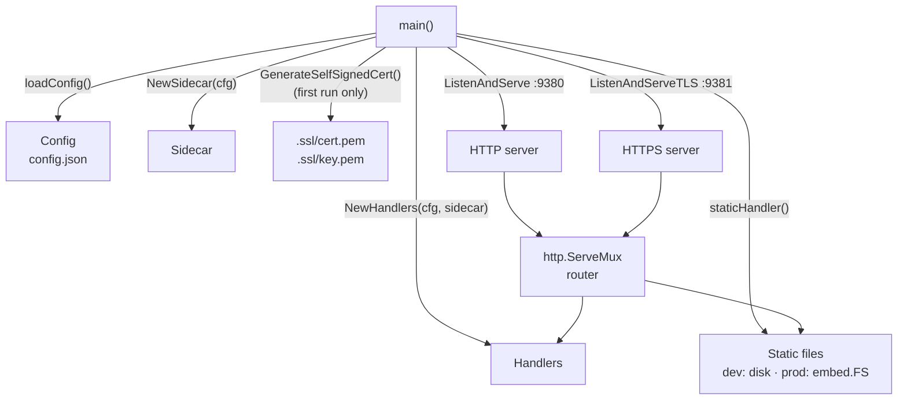
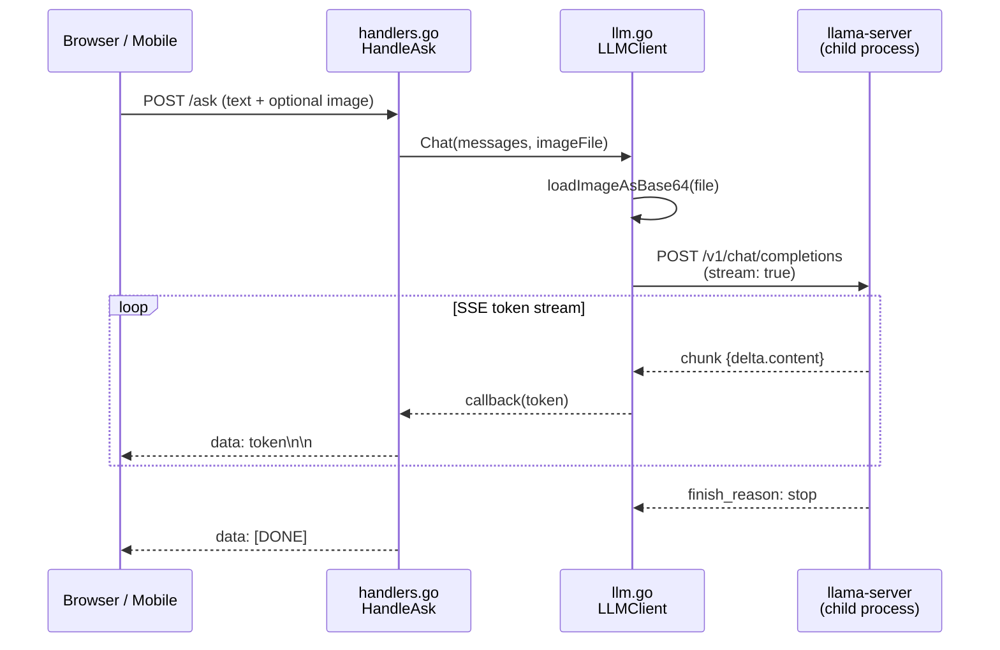
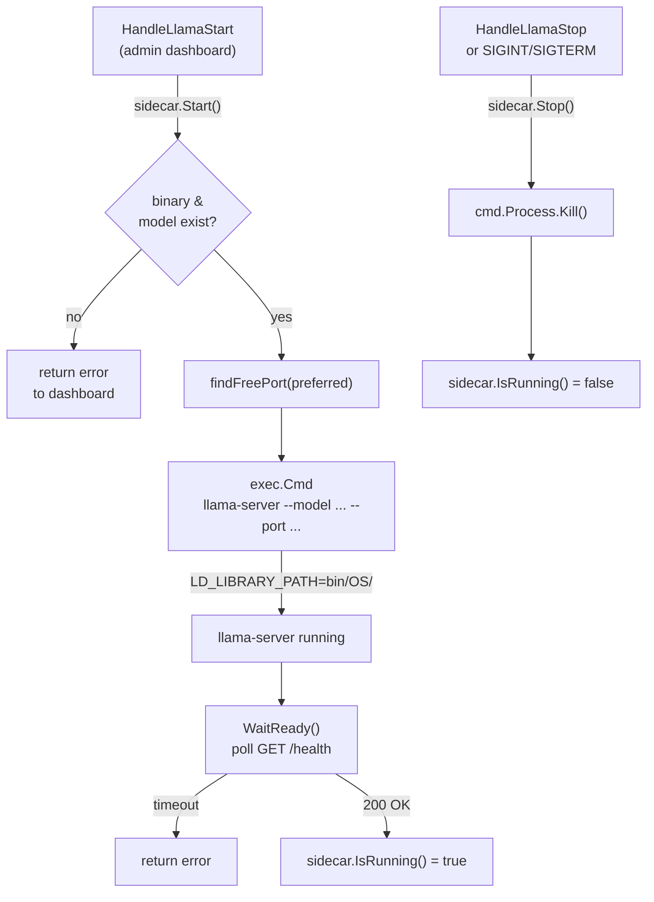
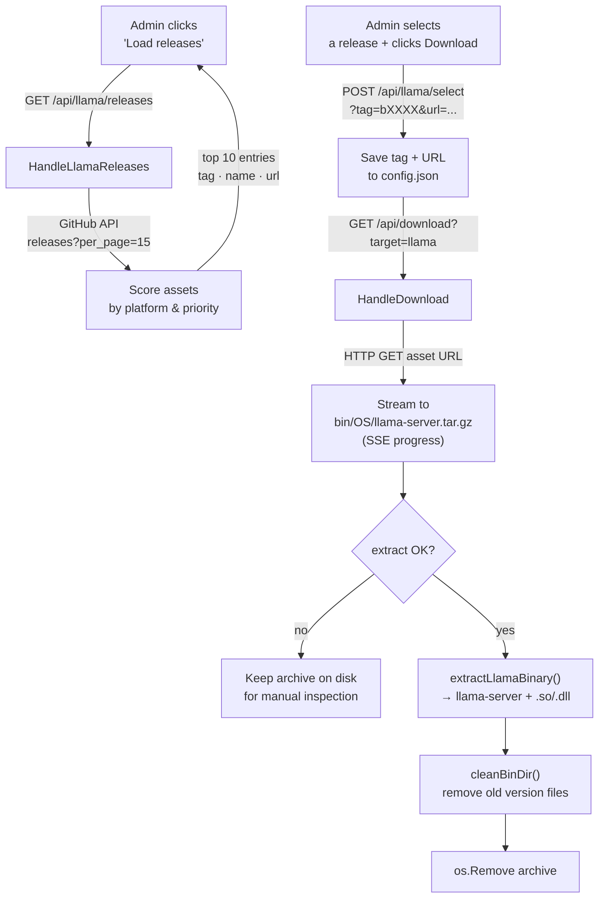
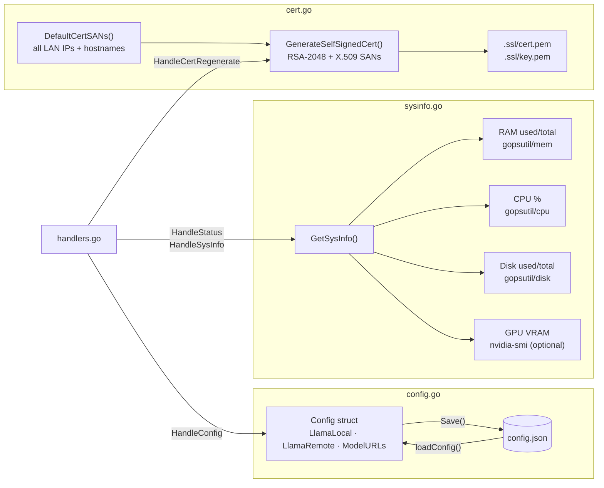

## Go Source Files

### main.go — Entry Point & Router
**Purpose:** bootstraps the application, wires all components, starts HTTP/HTTPS servers.
- Loads config.json, creates `Sidecar` and `Handlers`, registers all routes
- UA detection: `/` → `admin.html` (desktop) or `eye.html` (mobile)
- Prints QR code and LAN URL on startup; generates TLS cert on first run
- Graceful shutdown on `SIGINT`/`SIGTERM`

Key functions: `main()`, `getLANIP()`, `getLANIPs()`, `getMobileIP()`, `printQR()`

---

### config.go — Configuration
**Purpose:** defines all config structs and handles persistence to config.json.
- Structs: `Config`, `LlamaLocal`, `LlamaRemote`, `ModelURLs`
- Package-level constants for all default model URLs and paths
- `loadConfig()` reads and parses; `cfg.Save()` writes back atomically
- `cfg.IsRemote()` / `cfg.ActiveEndpoint()` — routing helpers used by handlers

---

### handlers.go — HTTP Handler Layer
**Purpose:** implements every HTTP endpoint — the single largest file.

| Handler | Responsibility |
|---|---|
| `HandleAsk` | Chat + optional image → streams LLM response as SSE |
| `HandleStatus` | JSON snapshot: sidecar state, model, binary, sysinfo |
| `HandleLlamaStart/Stop` | Start/stop the sidecar child process |
| `HandleLlamaReleases` | GitHub API → scored asset list per platform |
| `HandleLlamaSelect` | Saves chosen tag + real asset URL to config |
| `HandleDownload` | SSE-streamed download; extracts archives; cleans old libs |
| `HandleModelSelect` / `HandleVisionToggle` | Update and persist model config |
| `HandleConfig` | GET/POST the runtime configuration |
| `HandleCertRegenerate` | Regenerates the self-signed TLS cert |
| `HandleLlamaTest` | Sends a minimal prompt, returns latency |
| `HandleQR` / `HandleQRURL` | Serves QR code PNG / JSON URL |

Internal helpers: `extractLlamaBinary()`, `extractFromTarGzAll()`, `extractFromZipAll()`, `cleanBinDir()`, `llamaBinaryURLForTag()`

---

### llm.go — LLM Client
**Purpose:** encapsulates all communication with llama-server's OpenAI-compatible API.
- `Chat()` builds a `/v1/chat/completions` streaming request, supports text-only and multimodal (text + base64 image)
- Parses SSE chunks, calls a token callback for each delta
- `loadImageAsBase64()` encodes an uploaded file for multimodal payloads

Key types: `LLMClient`, `ChatMessage`, `ContentPart`, `ChatRequest`, `StreamChunk`

---

### sidecar.go — llama-server Process Manager
**Purpose:** manages the `llama-server` child process lifecycle.
- `Start()` — finds a free port, validates binary/model, builds CLI args (including `--mmproj` for vision), sets `LD_LIBRARY_PATH`, spawns process
- `Stop()` — graceful termination
- `IsRunning()` — liveness check
- `WaitReady()` — polls health endpoint until ready or timeout

---

### cert.go — TLS Certificate Generator
**Purpose:** generates a self-signed RSA-2048 certificate at first run — no `openssl` dependency.
- `GenerateSelfSignedCert()` — RSA-2048 key + X.509 cert with SANs, writes to .ssl
- `DefaultCertSANs()` — collects all LAN IPs + hostnames for a LAN-valid certificate

---

### sysinfo.go — System Resource Monitor
**Purpose:** cross-platform hardware snapshot using `gopsutil`.
- Collects RAM, CPU (1-second sample), disk usage
- GPU stats via `nvidia-smi` — best-effort, silently skipped if unavailable

---

### static_dev.go / static_prod.go — Static File Serving
**Purpose:** build-tag pair providing two implementations of `staticHandler()`.
- **`dev` tag:** serves static from disk — live edits without rebuild
- **default (prod):** embeds static into the binary via `//go:embed` — fully self-contained release

---

## Diagrams

### 1 — Bootstrap sequence

How `main()` wires the components together at startup.

---

### 2 — Chat request flow

Path of a user message from the browser to the model and back.

---

### 3 — llama-server lifecycle

How the sidecar starts, waits for readiness, and shuts down.

---

### 4 — llama-server download & extraction

How a release is selected, downloaded, and installed.

---

### 5 — Configuration & infrastructure

Config persistence, TLS certificate, and system monitoring.

