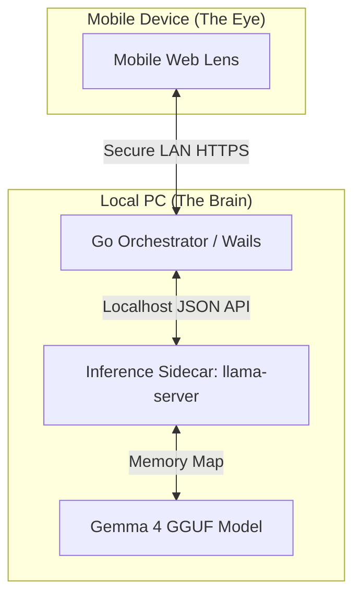
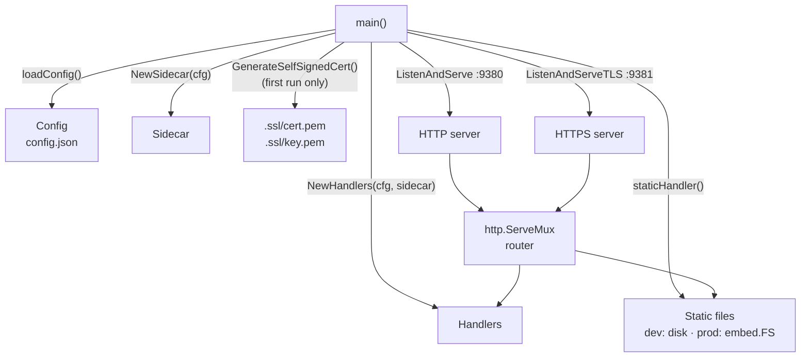
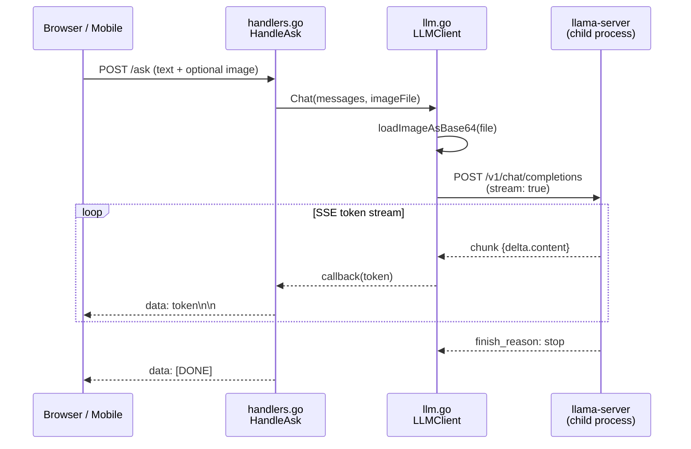
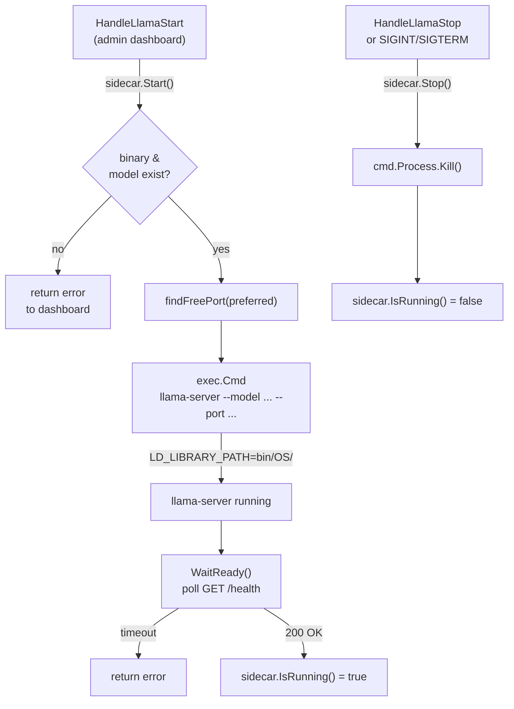
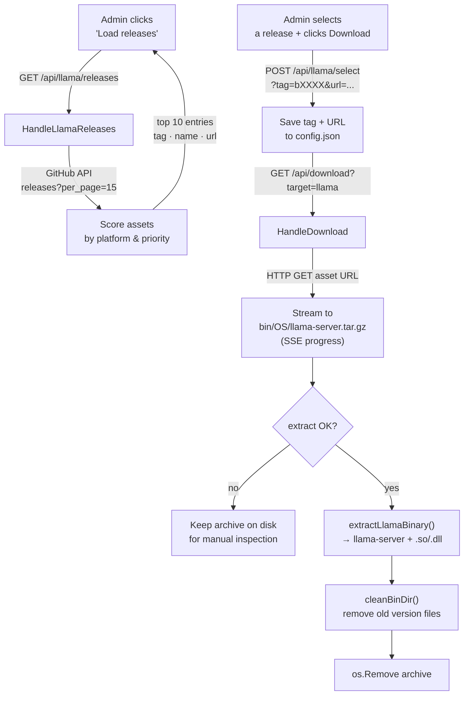
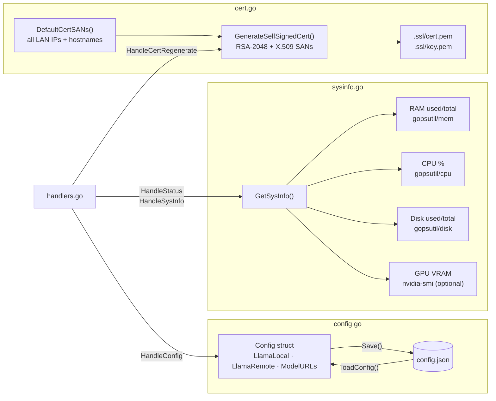

# Eye Assistant Architecture

GemmaLink: Eye Assistant is a **Zero-Footprint**, private AI ecosystem designed to bridge a mobile device's camera with a local AI model (Gemma 4) running on a workstation. It eliminates the need for cloud intermediaries or external tunnels, maintaining 100% data sovereignty.

## Architectural Pillars
*   **Privacy-First:** No external data egress. All inference and transport remain within the local subnet.
*   **Minimalist Deployment:** A single Go binary manages the life cycle of the entire stack.
*   **Backend Agility:** The system dynamically identifies and scores available hardware backends (Vulkan vs AVX2) to ensure the best performance on consumer hardware.
*   **Technical Abstraction:** The orchestrator masks the complexity of local LLM management. It handles binary scoring, port allocation, and health monitoring, providing a "consumer-grade" experience for a high-end technical stack.

## Technical Stack
*   **Backend & Orchestrator:** Written in **Go** for high-concurrency process management and minimal memory footprint.
*   **Inference Engine:** `llama-server` (llama.cpp) running as a sidecar process.
*   **Model:** **Gemma 4**, specifically leveraged for its multimodal vision-to-text reasoning capabilities.
*   **Desktop UI:** Wails (Go + Svelte) providing a native OS experience.
*   **Mobile Lens:** A lightweight JS/HTML5 interface served via the internal Go HTTP server.

## System Components

## Data Flow & Security

1. **Secure Context:** The Go backend generates a self-signed TLS certificate to satisfy browser requirements for `getUserMedia` (camera access) without external CA validation.
2. **Inference Pipeline:** Frames are captured by the "Lens", transmitted over the LAN via HTTPS, and fed directly into the sidecar's JSON API.
3. **Process Management:** The orchestrator monitors the sidecar's health and manages the MMAP'd model memory to prevent leaks and ensure a clean exit.

## Diagrams

### 1 — Bootstrap sequence

How `main()` wires the components together at startup.

---

### 2 — Chat request flow

Path of a user message from the browser to the model and back.

---

### 3 — llama-server lifecycle

How the sidecar starts, waits for readiness, and shuts down.

---

### 4 — llama-server download & extraction

How a release is selected, downloaded, and installed.

---

### 5 — Configuration & infrastructure

Config persistence, TLS certificate, and system monitoring.

